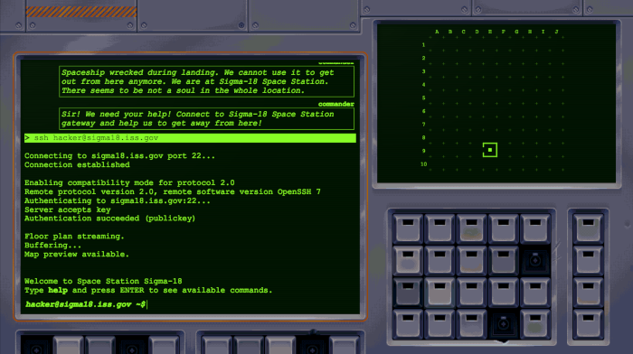

# Sigma-18 Game
My submission to [Gynvael's Winter GameDev Challenge 2018/19](https://gynvael.coldwind.pl/?lang=en&id=697).

The **DEMO** is available here: [http://sigma18.jmrlab.com](http://sigma18.jmrlab.com).

# Rules of the Challenge
Create a game that meets the following requirements:

- **Theme:** unrealistic hacking simulator, the player is a space marine's tech/hacker that aids a squad of space marines while they explore an abandoned space station.
- **Dual screen:** It must render [this overlay](resources/img/gwgc201819_overlay.png) on top of everything - it only allows to draw game content in two regions (assume these are two separate displays on a spaceship's console).
- **Technology:** client-side web technology that runs on the newest stable Chrome on Windows 10 (1803/1809) in a 1920x1080 resolution.
- **File size limit:** 128000 bytes (excluding overlay image, source codes and documentation)
- **Submission deadline:** 31st of January 2019, 11:59pm AoE

More details at [Gynvael's Winter GameDev Challenge 2018/19](https://gynvael.coldwind.pl/?lang=en&id=697)

# Software Requirements
In order to reduce file size (see challenge rules for more details), the game works only in following web browsers:
- Google Chrome: version 56+, **(RECOMMENDED)**
- FireFox: version: 51+,
- Microsoft Edge: version 15+,
- Safari: version 10+,
- Opera: version 42+

# The Plot
It's the year 2080. You are a space marine's tech who specializes in security and hacking. The squad that you are supporting is leading by commander Alex Decker. They are on their way back home from a reconnaissance mission in The Teta Colony. Unfortunately, the spaceship was damaged and they were forced to have an emergency landing at International Space Station Sigma-18. The ship was wrecked during the landing so you must help the squad to find another way out.

# How to Start
Go to game directory and run `npm start`. It sould start a local web server available at [http://localhost:8080/](http://localhost:8080/). Open the webpage and have fun!
```bash
Starting up http-server, serving ./dist
Available on:
  http://127.0.0.1:8080
Hit CTRL-C to stop the server
```

# How to Play


You should be able to find all instruction in the game. Here are a few hints for the beginning:

- use left console to run commands and hack systems of ISS Sigma-18
- right screen shows map and current location of the squad. Only visited location are show on the map
- to list all available commands type **help** and press ENTER. At the beginning there is not many of them available, however, you will get more commands as proceeding in the game
- **up/down arrows** navigates through the history of the console
- to get help about specific command run **[CommandName help]**. (For example **sfx help**)
- You can communicate with commander Decker via **com** command. See **com help** for more info.
- If you really got stuck, you can ask commander Decker for help by running **com hint**. However you should be able to complete the game without that.

# Known Issues
- Not working on Internet Explorer (due to code optimization to meet 128000 bytes size limit). Recommended to play on latest version of Chrome.
- The game does not save the progress. After closing the web browser your progress will be lost.

# Code Quality
Due to the limit of 128000 bytes, this is not the most beautiful code that you can find on the Internet :) Focus on the gameplay and have fun instead :)
